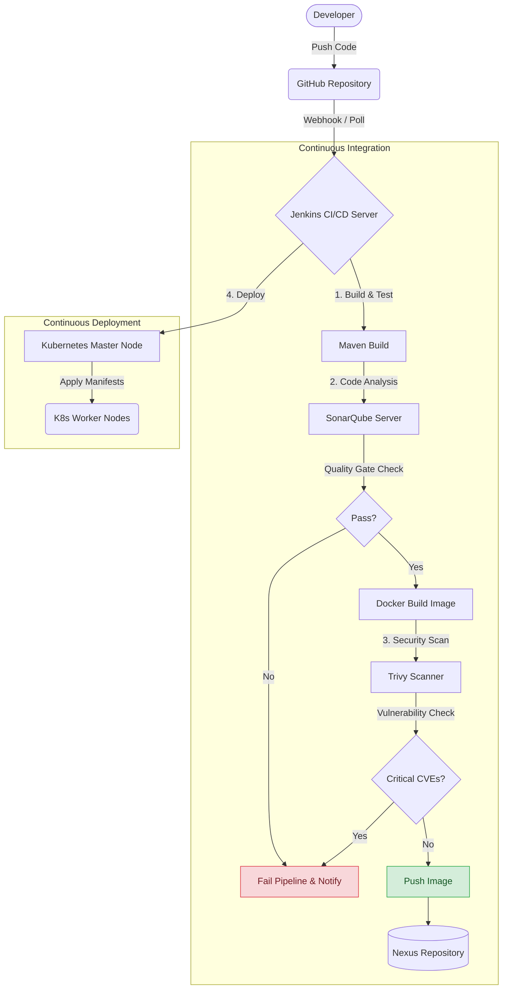
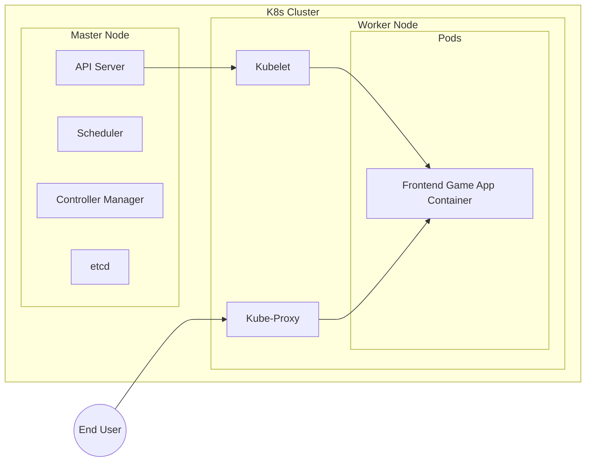

# 🏛️ System & DevOps Architecture

This outline provides a deeper view of the tools, interaction points, and infrastructure set up for the **End-to-End DevOps CI/CD Pipeline**.

## 1. High-Level CI/CD Workflow

The pipeline triggers automatically on every push, ensuring code is built, tested, scanned, and securely deployed.

## 2. Infrastructure Setup (Multi-VM)

The project simulates a real-world enterprise setup by segregating concerns across four distinct Virtual Machines (VMs). 

| Server / VM | Role | Key Services Running |
|-------------|------|----------------------|
| **VM 1: Jenkins Server** | Orchestrates the entire CI/CD pipeline. | `Jenkins`, `Maven`, `Docker CLI`, `Trivy CLI`, `kubectl` |
| **VM 2: SonarQube** | Static code analysis and quality gating. | `SonarQube` |
| **VM 3: Nexus Repository** | Private registry for storing built artifacts and Docker images. | `Sonatype Nexus` |
| **VM 4: K8s Cluster** | The runtime environment for the deployed application. | `kubelet`, `kubeadm`, `containerd` / `docker` |

*(Note: In a production environment, the Kubernetes cluster typically consists of at least 3 master nodes for high availability and multiple worker nodes.)*

## 3. Kubernetes Cluster Architecture

Once Jenkins triggers the deployment, the Kubernetes cluster handles container orchestration.

### Key Kubernetes Components Used:
- **Deployment**: Manages the replicas of the application pod and ensures desired state.
- **Service**: Exposes the frontend game reliably (typically via NodePort or LoadBalancer).
- **RBAC (Role-Based Access Control)**: Custom Roles and RoleBindings to restrict access within the namespace, enforcing the principle of least privilege.

## 4. Security Architecture

Security is baked into multiple layers of this architecture:
- **SAST (Static Application Security Testing)**: SonarQube scans the code structure for bugs, code smells, and vulnerabilities before the build process completes.
- **Container Scanning**: Trivy scans the Docker image for known OS-level CVEs and vulnerable dependencies. The pipeline is configured to fail if critical vulnerabilities are detected.
- **Cluster Security**: Kubernetes ServiceAccounts are restricted using RBAC, ensuring that Jenkins only has the permissions necessary to deploy to a specific namespace.
