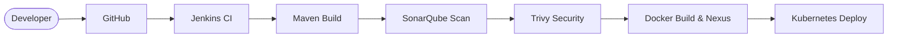

# 🚀 End-to-End DevOps CI/CD Pipeline on Kubernetes


---

## 📌 Project Overview

This project demonstrates a complete real-world DevOps pipeline designed to automate the build, test, security scanning, and deployment of a web application on a Kubernetes cluster.

Although the application used is a simple frontend game, the primary focus of this project is on implementing enterprise-level DevOps practices, including CI/CD automation, containerization, artifact management, and secure Kubernetes deployment.

---

## 🎯 Key Highlights

- ⚙️ Designed a full CI/CD pipeline using Jenkins  
- 🐳 Containerized application using Docker  
- ☸️ Deployed application on a Kubernetes cluster (K8s)  
- 🔐 Integrated security scanning (Trivy + SonarQube)  
- 📦 Managed artifacts using Nexus Repository Manager  
- 🔑 Implemented RBAC (Role-Based Access Control) in Kubernetes  
- 📧 Configured email notifications for pipeline status  
- 🌐 Built a production-like multi-VM infrastructure setup  

---

## 🏗️ Architecture

For a detailed breakdown of the CI/CD workflow, Infrastructure setup, and security enforcement, please refer to the **[ARCHITECTURE.md](./ARCHITECTURE.md)** file.

**High-Level Flow:**


---

## ⚙️ Tech Stack

| Category            | Tools Used |
|--------------------|----------|
| CI/CD              | Jenkins |
| Containerization   | Docker |
| Orchestration      | Kubernetes (Kubeadm) |
| Code Quality       | SonarQube |
| Security           | Trivy |
| Artifact Storage   | Nexus |
| Version Control    | Git & GitHub |
| Infrastructure     | Virtual Machines |

---

## 🛠️ Prerequisites & Quick Start

If you'd like to replicate or understand the deployment process:

**Requirements:**
- 4 Virtual Machines (Ubuntu 20.04/22.04 recommended)
- Minimum 4GB RAM per VM (especially for SonarQube & Nexus)
- Pre-installed: Git, Docker, Java, Jenkins, Kubeadm

**Manual Deployment Snippet (Example):**
If bypassing the CI/CD pipeline, the app can be deployed locally using standard Kubernetes commands:
```bash
# Apply the deployment and service manifests
kubectl apply -f deployment-service.yaml

# Verify the pods are running
kubectl get pods

# Access the application (depending on Service type)
kubectl get svc
```

---

## 🧱 Infrastructure Setup

Created multiple virtual machines for:

- Jenkins Server  
- SonarQube Server  
- Nexus Repository  
- Kubernetes Master & Worker Nodes  

Configured Kubernetes cluster using:

- kubeadm  
- kubectl  
- kubelet  

Enabled secure communication between services  

---

## 🔄 CI/CD Pipeline Workflow

### 1️⃣ Source Code Integration
Code pushed to GitHub triggers Jenkins pipeline  

### 2️⃣ Build Phase
Application is compiled and prepared for deployment  

### 3️⃣ Code Quality Analysis
SonarQube performs static code analysis  

### 4️⃣ Security Scanning
Trivy scans for vulnerabilities in dependencies and Docker images  

### 5️⃣ Artifact Management
Build artifacts are stored in Nexus repository  

### 6️⃣ Containerization
Docker image is built and tagged  

### 7️⃣ Deployment
Application is deployed to Kubernetes cluster using manifests  

### 8️⃣ Notifications
Email alerts are sent for pipeline success/failure  

---

## 🔐 Security Implementation

- Integrated Trivy for vulnerability scanning  
- Enforced RBAC in Kubernetes  
- Used secure credentials management in Jenkins  
- Restricted access using role-based permissions  

---

## 🚧 Challenges & Learning

- Setting up multi-node Kubernetes cluster manually  
- Managing secure communication between Jenkins and K8s  
- Integrating multiple tools into a single pipeline  
- Handling credentials and access control securely  

---

## 📈 Outcome

- Achieved a fully automated end-to-end CI/CD pipeline  
- Reduced manual deployment effort significantly  
- Ensured code quality and security before deployment  
- Simulated a real corporate DevOps environment  

---

## ❗ Note

- Monitoring tools (Prometheus/Grafana) were not implemented in this project  
- Infrastructure was created for learning purposes and later decommissioned  

---

## 👨‍💻 Author

**Aadi Jain**  
Cloud & DevOps Enthusiast | Java Full Stack Developer  

---